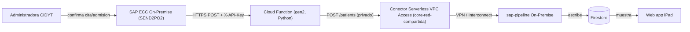

# Cloud Functions — Integración sap-pipeline (On-Premise)

Cloud Function (gen2, Python) que **finaliza la integración del microservicio
`sap-pipeline`**. Es un **relay HTTPS**: SAP la llama cuando la administradora
confirma una cita/admisión, y la función **reenvía** el payload al servicio
`sap-pipeline` disponible **On-Premise** vía `POST /patients`, usando
conectividad privada a través de la **VPC compartida `core-red-compartida`**.



La función es un **passthrough**: devuelve a SAP el status y cuerpo reales que
respondió `sap-pipeline`, para que SAP conozca el resultado de la ingesta. La
escritura en Firestore (validación, dedup por `no_cita`, normalización de
fechas) la hace `sap-pipeline`, no la función.

## Payload recibido (y reenviado tal cual)

Es el formato que produce SAP (método ABAP `SEND2PO2`) y que `sap-pipeline` ya
acepta en `POST /patients`:

```json
{
  "controller": [],
  "message": { "controller": [], "type": "Import", "event": "Insertpatient", "messageid": "CIDYT0000211960" },
  "patient": { "controller": [], "patNoCita": "0000211960", "patFechaCita": "2026/06/25", "...": "..." }
}
```

## Seguridad

- **Entrada (SAP → función):** la función es pública, por lo que exige un secreto
  compartido en la cabecera `X-API-Key` (configurable con `SAP_API_KEY_HEADER`).
  Se compara en tiempo constante y es **fail-closed**: si el secreto no está
  configurado, toda petición se rechaza con `401`.
- **Salida (función → On-Premise):** auth opcional reenviada al pipeline
  (`ON_PREM_AUTH_HEADER` + secret `ON_PREM_AUTH_VALUE`). El tráfico sale por la
  red privada (`PRIVATE_RANGES_ONLY`).

Los **secretos** se gestionan con Firebase Secret Manager (no en `.env`):

```bash
firebase functions:secrets:set SAP_INBOUND_API_KEY
firebase functions:secrets:set ON_PREM_AUTH_VALUE   # (opcional)
```

## Configuración (variables de entorno)

Copia `.env.example` a `.env` (o `.env.ipad-cidyt`) y rellena:

| Variable | Descripción |
|---|---|
| `FUNCTION_REGION` | Región de la función (= región del conector). |
| `VPC_CONNECTOR` | Recurso completo del conector en `core-red-compartida`. |
| `ON_PREM_BASE_URL` | URL privada del sap-pipeline On-Premise. |
| `ON_PREM_PATIENTS_PATH` | Ruta del endpoint (por defecto `/patients`). |
| `ON_PREM_TIMEOUT_SEC` | Timeout de la petición HTTP. |
| `SAP_API_KEY_HEADER` | Nombre del header de auth de entrada (por defecto `X-API-Key`). |
| `ON_PREM_AUTH_HEADER` | (Opcional) nombre del header de auth hacia On-Premise. |

> Secretos (NO van en `.env`): `SAP_INBOUND_API_KEY`, `ON_PREM_AUTH_VALUE`.

## Conectividad privada (VPC compartida `core-red-compartida`)

1. Crea el conector de Serverless VPC Access **en el host project** de la
   Shared VPC y otorga los permisos necesarios:

   ```bash
   HOST_PROJECT_ID=<host-project> SERVICE_PROJECT_ID=ipad-cidyt \
   SUBNET=<subnet-/28-en-host> ./setup_vpc_connector.sh
   ```

2. Copia la referencia que imprime el script a `VPC_CONNECTOR` en `.env`:

   ```
   projects/<HOST_PROJECT_ID>/locations/us-central1/connectors/core-red-compartida-conn
   ```

> El conector debe estar en la **misma región** que la función y la red debe
> tener ruta (VPN/Interconnect) hacia el segmento On-Premise donde corre
> `sap-pipeline`. Egress configurado como `PRIVATE_RANGES_ONLY`.

## APIs requeridas (proyecto en plan Blaze)

Para Cloud Functions HTTP de 2ª generación:

```bash
gcloud services enable \
  cloudfunctions.googleapis.com \
  run.googleapis.com \
  cloudbuild.googleapis.com \
  artifactregistry.googleapis.com \
  vpcaccess.googleapis.com \
  --project=ipad-cidyt
```

## Despliegue (Firebase CLI)

```bash
# desde la raíz del repo
firebase deploy --only functions
```

## Pruebas locales (emulador)

El conector VPC se ignora en el emulador, así que se puede probar todo el relay
apuntando `ON_PREM_BASE_URL` a un `sap-pipeline` (o al `test_api` Flask) local.

```bash
# 1) Levanta el receptor local (ej. sap-pipeline en :8000)
#    En functions/.env: ON_PREM_BASE_URL=http://host.docker.internal:8000
#    y define el secreto de entrada para el emulador:
export SAP_INBOUND_API_KEY=clave-de-prueba

# 2) Arranca el emulador
firebase emulators:start --only functions

# 3) Envía el payload de ejemplo a la URL local de la función
curl -X POST "<URL-local-de-la-funcion>" \
  -H "Content-Type: application/json; charset=utf-8" \
  -H "X-API-Key: clave-de-prueba" \
  -d @../test_api/received_messages/msg_20260625_113220_441075.json
```

Verifica en los logs el reenvío y que la respuesta es el passthrough del
pipeline. El único tramo no cubierto en local es el salto por la red privada,
que queda validado al desplegar con el conector de `core-red-compartida`.
